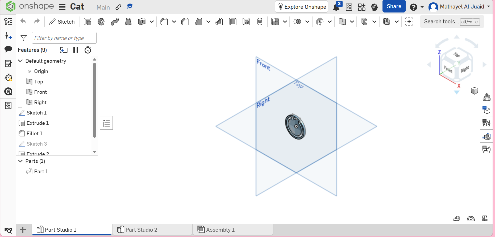

# Medal Design – Mechanical Task

## Description
This repository contains a simple 3D medal created in Onshape for a mechanical design assignment.  
The medal is a single solid part with a top hole for attaching a keychain.  
The final model is exported as an STL file and ready for 3D printing.

## Preview

## Files
- medal.stl – Final 3D model  
- Onshape link: (add your link here)

## Result
A clean and printable 3D medal uploaded as part of the required task.
